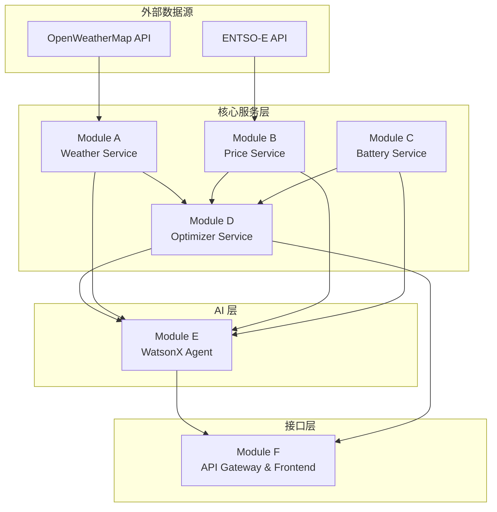

# GridKey BESS Optimizer + WatsonX Agentic AI 升级方案

## 总纲

---

### 1. 项目背景

本项目基于已有的 **GridKey BESS Optimizer**（华为 TechArena 2025 参赛项目）进行升级。原项目实现了一套成熟的 MILP 优化引擎，能够在四个欧洲电力市场（Day-Ahead、FCR、aFRR 容量、aFRR 能量）中进行电池储能系统的收益最大化调度，并考虑电池退化成本。

原项目使用 **2024 年历史数据**进行回测验证。本次升级的核心目标是：将其改造为一个**实时数据驱动、AI Agent 协调**的智能调度系统，参加 IBM Dev Day Hackathon，同时为 Entrix 面试的 API Development Case Study 做准备。

---

### 2. 项目目标

1. **实时化**：接入真实的天气预报 API 和电力市场价格 API，替代静态历史数据
2. **API 化**：将优化引擎封装为可调用的 REST API 服务
3. **智能化**：利用 IBM WatsonX 构建 Agentic AI 层，实现自然语言交互和多步骤任务编排
4. **可演示**：提供直观的前端界面，展示完整的"数据获取 → 优化计算 → 结果解释"流程

---

### 3. 系统模块概述

本系统由以下 **六大模块** 组成：

| 模块                                       | 职责                               | 数据来源                        |
| ------------------------------------------ | ---------------------------------- | ------------------------------- |
| **Module A: Weather Service**        | 获取天气预报，预测光伏、风力发电量 | 外部 API (OpenWeatherMap)       |
| **Module B: Price Service**          | 获取电力市场实时/预测价格          | 外部 API (ENTSO-E Transparency) |
| **Module C: Battery Service**        | 管理电池状态，模拟设备上报         | 本地模拟 + 配置文件             |
| **Module D: Optimizer Service**      | 核心 MILP 优化引擎                 | 本地已有 (GridKey)              |
| **Module E: WatsonX Agent Layer**    | AI 编排、自然语言理解、结果解释    | IBM WatsonX                     |
| **Module F: API Gateway & Frontend** | 统一入口、用户界面                 | 本地开发                        |

---

### 4. 预期效果

**用户交互示例：**

```
用户: "明天柏林天气怎么样？帮我优化一下德国市场的电池调度，考虑光伏发电。"

系统执行流程:
1. [Weather Service] 获取MUC未来24小时天气预报
2. [Weather Service] 基于辐照度预测光伏发电量，基于风力信息预测风力发电量。
3. [Price Service] 获取德国 Day-Ahead 及储备市场价格预测
4. [Battery Service] 获取当前电池状态（SOC、SOH、可用容量）
5. [Optimizer Service] 运行 MILP 优化，生成调度计划
6. [WatsonX Agent] 用自然语言解释优化结果和策略建议

系统输出:
"明天柏林晴朗，大风，预计光伏发电 18.5 kWh。结合电价分析：
- 建议凌晨 2-5 点充电（电价 €32/MWh，较低）
- 上午 8-10 点放电参与 FCR（容量价格 €9.2/MW）
- 中午暂停操作，等待光伏充电
- 晚高峰 18-21 点放电套利（电价 €89/MWh）
预计净收益 €127，电池循环 0.8 次。"
```

---

### 5. 模块信息掌握度总览

| 模块                   | 已掌握                              | 需外部获取                    | 需 IBM 提供              |
| ---------------------- | ----------------------------------- | ----------------------------- | ------------------------ |
| **A: Weather**   | 光伏发电计算公式                    | 天气预报数据 (OpenWeatherMap) | -                        |
| **B: Price**     | 市场结构理解、历史数据格式          | 实时价格 (ENTSO-E API)        | -                        |
| **C: Battery**   | 电池物理参数、退化模型              | -                             | -                        |
| **D: Optimizer** | **完整实现** (Model I/II/III) | -                             | -                        |
| **E: WatsonX**   | Agent 概念理解                      | -                             | Orchestrate SDK、LLM API |
| **F: Gateway**   | FastAPI/Streamlit 经验              | -                             | -                        |

---

## Module A: Weather Service（修正版）

### 职责

获取气象预报数据，为可再生能源发电预测提供输入。支持两类发电资产：

| 资产类型              | 关键气象参数           | 输出             |
| --------------------- | ---------------------- | ---------------- |
| **光伏 (PV)**   | 太阳辐照度、云量、温度 | 预测发电量 (kWh) |
| **风电 (Wind)** | 风速、风向             | 预测发电量 (kWh) |

### 完整气象参数清单

| 参数                     | 用途                | 优先级 |
| ------------------------ | ------------------- | ------ |
| Solar Irradiance (W/m²) | PV 发电预测         | P0     |
| Wind Speed (m/s)         | 风电发电预测        | P0     |
| Wind Direction (°)      | 风机朝向修正        | P1     |
| Temperature (°C)        | 电池性能 + 负荷预测 | P0     |
| Cloud Cover (%)          | PV 发电修正         | P1     |
| Humidity (%)             | 电池性能 + 负荷预测 | P2     |
| Precipitation (mm)       | 水电预测 + 负荷预测 | P2     |

### 数据来源

外部 API：**OpenWeatherMap** (或 Open-Meteo 作为备选)

---

## 六模块依赖关系图



### 依赖关系说明

| 依赖路径             | 说明                                               |
| -------------------- | -------------------------------------------------- |
| `External → A, B` | Weather 和 Price 服务依赖外部 API 获取实时数据     |
| `A, B, C → D`     | Optimizer 需要天气预测、电价预测、电池状态作为输入 |
| `A, B, C, D → E`  | WatsonX Agent 可调用所有服务作为 Skills            |
| `E, D → F`        | Gateway 暴露 Agent 入口和直接优化入口              |

---

## Module A: Weather Service 详细设计

---

### 1. 模块职责

从外部气象 API 获取预报数据，转化为可再生能源发电量预测，供 Optimizer 使用。

---

### 2. 子模块结构

```python
class WeatherClient:
    '''
    气象数据获取客户端
  
    - Purpose: 调用 OpenWeatherMap API 获取指定位置的天气预报
    - Input: location (纬度/经度 或 城市名), forecast_hours (预测时长)
    - Output: WeatherForecast 对象（含逐小时气象参数）
    - Notes: 需要 API Key；考虑请求频率限制和缓存策略
    '''
    def get_forecast(self, location, forecast_hours) -> WeatherForecast:
        return weather_forecast  # TODO: implement


class WeatherForecast:
    '''
    气象预报数据模型
  
    - Purpose: 结构化存储逐小时气象数据
    - Fields:
        - timestamps: List[datetime]
        - solar_irradiance: List[float]  # W/m²
        - wind_speed: List[float]        # m/s
        - wind_direction: List[float]    # degrees
        - temperature: List[float]       # °C
        - cloud_cover: List[float]       # %
        - humidity: List[float]          # %
    - Notes: 时间分辨率应与 Optimizer 匹配（15分钟或1小时）
    '''
    pass  # TODO: implement


class PVForecaster:
    '''
    光伏发电量预测器
  
    - Purpose: 基于气象数据和光伏系统参数，预测发电量
    - Input: 
        - weather: WeatherForecast
        - pv_capacity_kw: 装机容量
        - panel_efficiency: 组件效率 (0-1)
        - orientation: 朝向/倾角（可选）
    - Output: List[float] 逐时段发电量 (kWh)
    - Notes: 简化模型：generation = irradiance × capacity × efficiency × (1 - cloud_factor)
    '''
    def predict(self, weather, pv_capacity_kw, panel_efficiency) -> list:
        return generation_kwh  # TODO: implement


class WindForecaster:
    '''
    风电发电量预测器
  
    - Purpose: 基于风速和风机参数，预测发电量
    - Input:
        - weather: WeatherForecast
        - turbine_capacity_kw: 风机额定功率
        - cut_in_speed: 切入风速 (m/s)
        - rated_speed: 额定风速 (m/s)
        - cut_out_speed: 切出风速 (m/s)
    - Output: List[float] 逐时段发电量 (kWh)
    - Notes: 使用风机功率曲线；超过切出风速时输出为0
    '''
    def predict(self, weather, turbine_capacity_kw, cut_in_speed, rated_speed, cut_out_speed) -> list:
        return generation_kwh  # TODO: implement


class WeatherService:
    '''
    Weather 模块对外统一接口
  
    - Purpose: 封装完整流程，供 Optimizer 和 Agent 调用
    - Input: location, forecast_hours, asset_config (PV/Wind 参数)
    - Output: GenerationForecast 对象（含 PV + Wind 预测）
    - Notes: 组合调用 WeatherClient + PVForecaster + WindForecaster
    '''
    def get_generation_forecast(self, location, forecast_hours, asset_config) -> GenerationForecast:
        return generation_forecast  # TODO: implement
```

---

### 3. 信息掌握度

| 子模块              | 已掌握           | 需外部获取                             | 备注                 |
| ------------------- | ---------------- | -------------------------------------- | -------------------- |
| `WeatherClient`   | API 调用方式     | **实时气象数据**(OpenWeatherMap) | 需注册 API Key       |
| `WeatherForecast` | 数据结构设计     | -                                      | 纯本地定义           |
| `PVForecaster`    | 发电计算公式     | -                                      | 公式已知，可简化实现 |
| `WindForecaster`  | 风机功率曲线原理 | 典型风机参数（可内置默认值）           | 公式已知             |
| `WeatherService`  | 封装逻辑         | -                                      | 组合上述组件         |

---

### 4. 待确认问题

1. **时间分辨率** ：OpenWeatherMap 免费版提供 3 小时分辨率，你的 Optimizer 需要 15 分钟。是否需要插值？还是接受 1 小时分辨率？
2. **资产配置** ：PV/Wind 的容量参数是固定配置，还是用户每次请求时传入？
3. **地理位置** ：是按国家中心点（如德国→柏林），还是允许用户指定具体坐标？

**Answer**:

| 决策项     | 结论                                  |
| ---------- | ------------------------------------- |
| 时间分辨率 | 尽量插值到 15 分钟，否则接受粗分辨率  |
| 资产配置   | 固定配置（内置默认值）                |
| 地理位置   | 支持 city name 或坐标，慕尼黑必须支持 |

---

## Module B: Price Service 详细设计

---

### 1. 模块职责

从外部电力市场 API 获取价格数据（实时或日前预测），供 Optimizer 使用。覆盖你现有模型的四个市场。

---

### 2. 目标市场

| 市场             | 数据类型      | 分辨率          | ENTSO-E 可获取性  |
| ---------------- | ------------- | --------------- | ----------------- |
| Day-Ahead Energy | 价格 (€/MWh) | 15 min / 1 hour | ✅ 可获取         |
| FCR Capacity     | 价格 (€/MW)  | 4-hour blocks   | ⚠️ 需确认数据源 |
| aFRR Capacity    | 价格 (€/MW)  | 4-hour blocks   | ⚠️ 需确认数据源 |
| aFRR Energy      | 价格 (€/MWh) | 15 min          | ⚠️ 需确认数据源 |

---

### 3. 子模块结构

```python
class PriceClient:
    '''
    电力市场价格数据获取客户端
  
    - Purpose: 调用 ENTSO-E Transparency API 获取市场价格
    - Input: 
        - country: 国家代码 (DE_LU, AT, CH, HU, CZ)
        - market_type: 市场类型 (day_ahead, fcr, afrr_capacity, afrr_energy)
        - start_time, end_time: 时间范围
    - Output: PriceData 对象
    - Notes: 需要 ENTSO-E API Token；不同市场可能需要不同的 API endpoint
    '''
    def get_prices(self, country, market_type, start_time, end_time) -> PriceData:
        return price_data  # TODO: implement


class PriceData:
    '''
    市场价格数据模型
  
    - Purpose: 结构化存储逐时段价格数据
    - Fields:
        - timestamps: List[datetime]
        - prices: List[float]  # €/MWh 或 €/MW
        - market_type: str
        - country: str
        - resolution_minutes: int
    - Notes: 保持与原 GridKey 数据格式兼容
    '''
    pass  # TODO: implement


class PriceForecastFallback:
    '''
    价格预测回退机制
  
    - Purpose: 当实时 API 不可用时，使用历史数据或简单预测
    - Input: country, market_type, target_date
    - Output: PriceData（基于历史同期数据）
    - Notes: 从本地 data/json/ 加载历史数据作为代理
    '''
    def get_fallback_prices(self, country, market_type, target_date) -> PriceData:
        return price_data  # TODO: implement


class PriceService:
    '''
    Price 模块对外统一接口
  
    - Purpose: 封装完整流程，供 Optimizer 和 Agent 调用
    - Input: country, forecast_hours
    - Output: MarketPrices 对象（含四个市场的价格数据）
    - Notes: 优先使用实时 API，失败时回退到历史数据
    '''
    def get_market_prices(self, country, forecast_hours) -> MarketPrices:
        return market_prices  # TODO: implement
```

---

### 4. 信息掌握度

| 子模块                    | 已掌握                             | 需外部获取                      | 备注               |
| ------------------------- | ---------------------------------- | ------------------------------- | ------------------ |
| `PriceClient`           | API 调用方式                       | **实时价格数据**(ENTSO-E) | 需注册 Token       |
| `PriceData`             | 数据结构（与现有 GridKey 一致）    | -                               | 纯本地定义         |
| `PriceForecastFallback` | **完整历史数据**(data/json/) | -                               | 已有 2024 全年数据 |
| `PriceService`          | 封装逻辑                           | -                               | 组合上述组件       |

---

### 5. 待确认问题

1. **ENTSO-E 覆盖范围** ：ENTSO-E 主要提供 Day-Ahead 价格，FCR/aFRR 价格可能需要其他数据源（如 regelleistung.net）。是否接受：DA 用实时，FCR/aFRR 用历史数据回退？
2. **国家范围** ：是否需要支持全部 5 国 (DE_LU, AT, CH, HU, CZ)，还是 Hackathon 只演示 1-2 个国家？
3. **数据格式兼容** ：`PriceData` 是否需要直接兼容你现有的 `data/json/` 格式，以便 Optimizer 无需修改即可使用？

#### Module B 更新确认

| 决策项     | 结论                       |
| ---------- | -------------------------- |
| 市场数据源 | 全部四个市场都需要实时数据 |
| 国家范围   | 仅 DE_LU                   |
| 数据格式   | 兼容现有 JSON 格式         |

##### MILP 模块 Input of Market Data 数据样例:

The whole data set spans across the whole year of 2024 with 15-minute resolution for DA market and aFRR energy markets, and 4-hour resolution for FCR and aFRR capacity markets. Below we provide sample data snippets for each market.

```json
# DA Data: For DA data, DE_LU column represents the joint Germany and Luxembourg market prices.
[
  {
    "timestamp":"2024-01-01T00:00:00.000",
    "DE_LU":39.91,
    "AT":14.08,
    "CH":25.97,
    "HU":0.1,
    "CZ":0.1
  },
  {
    "timestamp":"2024-01-01T00:15:00.000",
    "DE_LU":-0.04,
    "AT":14.08,
    "CH":25.97,
    "HU":0.1,
    "CZ":0.1
  },
  {
    "timestamp":"2024-01-01T00:30:00.001",
    "DE_LU":-9.01,
    "AT":0.48,
    "CH":25.97,
    "HU":0.1,
    "CZ":0.1
  },
  {
    "timestamp":"2024-01-01T00:45:00.001",
    "DE_LU":-29.91,
    "AT":-3.64,
    "CH":25.97,
    "HU":0.1,
    "CZ":0.1
  }
]

### aFRR Energy
json
[
  {
    "timestamp":"2024-01-01T00:00:00.000",
    "DE_Pos":50.3411486486,
    "DE_Neg":29.702029703,
    "AT_Pos":86.43,
    "AT_Neg":0.0,
    "CH_Pos":38.7,
    "CH_Neg":0.0,
    "HU_Pos":0.0,
    "HU_Neg":0.0,
    "CZ_Pos":144.0,
    "CZ_Neg":0.0
  },
  {
    "timestamp":"2024-01-01T00:15:00.000",
    "DE_Pos":46.9457142857,
    "DE_Neg":40.87125,
    "AT_Pos":85.25,
    "AT_Neg":0.17,
    "CH_Pos":38.8,
    "CH_Neg":8.32,
    "HU_Pos":0.0,
    "HU_Neg":0.6014018923,
    "CZ_Pos":117.26,
    "CZ_Neg":53.39
  },
  {
    "timestamp":"2024-01-01T00:30:00.001",
    "DE_Pos":43.8748717949,
    "DE_Neg":21.2391111111,
    "AT_Pos":85.44,
    "AT_Neg":0.73,
    "CH_Pos":38.76,
    "CH_Neg":0.0,
    "HU_Pos":0.0,
    "HU_Neg":1.1334522217,
    "CZ_Pos":140.84,
    "CZ_Neg":62.84
  }
]

### FCR
json
[
  {
    "timestamp":"2024-01-01T00:00:00.000",
    "DE":114.8,
    "AT":114.8,
    "CH":114.8,
    "HU":3.1851080706,
    "CZ":416.0
  },
  {
    "timestamp":"2024-01-01T04:00:00.000",
    "DE":104.4,
    "AT":104.4,
    "CH":104.4,
    "HU":3.1851080706,
    "CZ":416.0
  },
  {
    "timestamp":"2024-01-01T08:00:00.001",
    "DE":68.8,
    "AT":68.8,
    "CH":68.8,
    "HU":3.1851080706,
    "CZ":416.0
  },
  {
    "timestamp":"2024-01-01T12:00:00.001",
    "DE":77.6,
    "AT":77.6,
    "CH":77.6,
    "HU":3.1851080706,
    "CZ":390.4
  }
]

### aFRR Capacity
json
[
  {
    "timestamp":"2024-01-01T08:00:00.001",
    "DE_Pos":6.33,
    "DE_Neg":13.07,
    "AT_Pos":5.57,
    "AT_Neg":8.5,
    "CH_Pos":6.66,
    "CH_Neg":23.08,
    "HU_Pos":10.048546094,
    "HU_Neg":13.327884282,
    "CZ_Pos":29.1639497143,
    "CZ_Neg":10.6757588259
  },
  {
    "timestamp":"2024-01-01T12:00:00.001",
    "DE_Pos":4.12,
    "DE_Neg":15.02,
    "AT_Pos":3.56,
    "AT_Neg":9.52,
    "CH_Pos":4.41,
    "CH_Neg":20.63,
    "HU_Pos":0.0,
    "HU_Neg":0.0,
    "CZ_Pos":23.342256,
    "CZ_Neg":4.1489131297
  },
]
```

---

##### 根据数据格式，我整理了各市场的实时数据源情况：

| 市场                    | 字段                          | 数据源选项           | 可行性                 |
| ----------------------- | ----------------------------- | -------------------- | ---------------------- |
| **DA**            | `DE_LU`(€/MWh)             | ENTSO-E Transparency | ✅ 确定可获取          |
| **FCR**           | `DE`(€/MW)                 | regelleistung.net    | ⚠️ 需确认 API 可用性 |
| **aFRR Capacity** | `DE_Pos`,`DE_Neg`(€/MW)  | regelleistung.net    | ⚠️ 需确认 API 可用性 |
| **aFRR Energy**   | `DE_Pos`,`DE_Neg`(€/MWh) | regelleistung.net    | ⚠️ 需确认 API 可用性 |

 **问题** ：regelleistung.net 的数据可能需要爬取或有访问限制。如果 48 小时内无法搞定实时接入，是否接受以下回退策略？

> DA 用 ENTSO-E 实时数据；FCR/aFRR 用本地历史数据 + 时间偏移模拟"实时"（例如取去年同一天数据）

这样演示效果一致，但实现风险更低。
