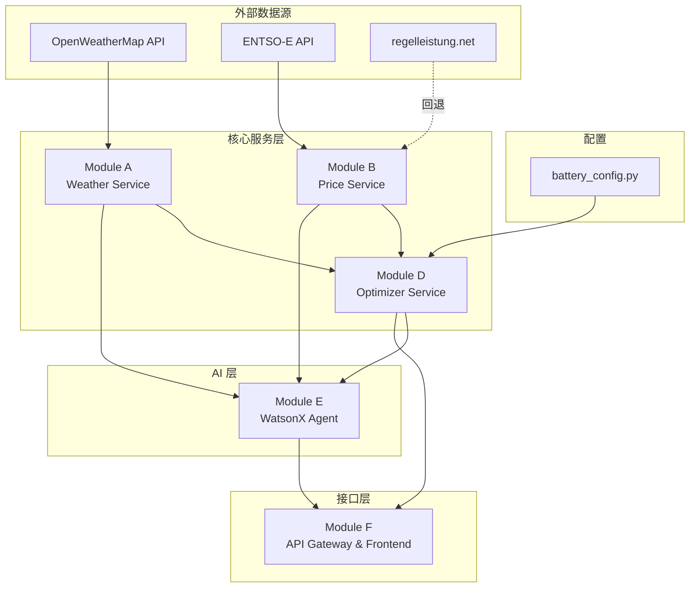

# GridKey BESS Optimizer + WatsonX Agentic AI 升级方案

## 总纲

---

### 1. 项目背景

本项目基于已有的 **GridKey BESS Optimizer**（华为 TechArena 2025 参赛项目）进行升级。原项目实现了一套成熟的 MILP 优化引擎，能够在四个欧洲电力市场（Day-Ahead、FCR、aFRR 容量、aFRR 能量）中进行电池储能系统的收益最大化调度，并考虑电池退化成本。

原项目使用 **2024 年历史数据**进行回测验证。本次升级的核心目标是：将其改造为一个**实时数据驱动、AI Agent 协调**的智能调度系统，参加 IBM Dev Day Hackathon，同时为 Entrix 面试的 API Development Case Study 做准备。

---

### 2. 项目目标

1. **实时化**：接入真实的天气预报 API 和电力市场价格 API，替代静态历史数据
2. **API 化**：将优化引擎封装为可调用的 REST API 服务
3. **智能化**：利用 IBM WatsonX 构建 Agentic AI 层，实现自然语言交互和多步骤任务编排
4. **可演示**：提供直观的前端界面，展示完整的"数据获取 → 优化计算 → 结果解释"流程

---

### 3. 系统模块概述

本系统由以下 **六大模块** 组成：

| 模块                                       | 职责                                | 数据来源                        |
| ------------------------------------------ | ----------------------------------- | ------------------------------- |
| **Module A: Weather Service**        | 获取天气预报，预测光伏、风力发电量  | 外部 API (OpenWeatherMap)       |
| **Module B: Price Service**          | 获取电力市场实时/预测价格           | 外部 API (ENTSO-E Transparency) |
| **Module C: Battery Config**         | Local Config电池状态，无需构建Agent | 本地模拟 + 配置文件             |
| **Module D: Optimizer Service**      | 核心 MILP 优化引擎                  | 本地已有 (GridKey)              |
| **Module E: WatsonX Agent Layer**    | AI 编排、自然语言理解、结果解释     | IBM WatsonX                     |
| **Module F: API Gateway & Frontend** | 统一入口、用户界面                  | 本地开发                        |

---

### 4. 预期效果

**用户交互示例：**

```
用户: "明天柏林天气怎么样？帮我优化一下德国市场的电池调度，考虑光伏发电。"

系统执行流程:
1. [Weather Service] 获取MUC未来24小时天气预报
2. [Weather Service] 基于辐照度预测光伏发电量，基于风力信息预测风力发电量。
3. [Price Service] 获取德国 Day-Ahead 及储备市场价格预测
4. [BatteryConfig] 获取当前电池状态（SOC、SOH、可用容量）
5. [Optimizer Service] 运行 MILP 优化，生成调度计划
6. [WatsonX Agent] 用自然语言解释优化结果和策略建议

系统输出:
"明天柏林晴朗，大风，预计光伏发电 18.5 kWh。结合电价分析：
- 建议凌晨 2-5 点充电（电价 €32/MWh，较低）
- 上午 8-10 点放电参与 FCR（容量价格 €9.2/MW）
- 中午暂停操作，等待光伏充电
- 晚高峰 18-21 点放电套利（电价 €89/MWh）
预计净收益 €127，电池循环 0.8 次。"
```

---

### 5. 模块信息掌握度总览

| 模块                   | 已掌握                              | 需外部获取                    | 需 IBM 提供              |
| ---------------------- | ----------------------------------- | ----------------------------- | ------------------------ |
| **A: Weather**   | 光伏发电计算公式                    | 天气预报数据 (OpenWeatherMap) | -                        |
| **B: Price**     | 市场结构理解、历史数据格式          | 实时价格 (ENTSO-E API)        | -                        |
| **C: Battery**   | 电池物理参数、退化模型              | -                             | -                        |
| **D: Optimizer** | **完整实现** (Model I/II/III) | -                             | -                        |
| **E: WatsonX**   | Agent 概念理解                      | -                             | Orchestrate SDK、LLM API |
| **F: Gateway**   | FastAPI/Streamlit 经验              | -                             | -                        |

---

## Module A: Weather Service（修正版）

### 职责

获取气象预报数据，为可再生能源发电预测提供输入。支持两类发电资产：

| 资产类型              | 关键气象参数           | 输出             |
| --------------------- | ---------------------- | ---------------- |
| **光伏 (PV)**   | 太阳辐照度、云量、温度 | 预测发电量 (kWh) |
| **风电 (Wind)** | 风速、风向             | 预测发电量 (kWh) |

### 完整气象参数清单

| 参数                     | 用途                | 优先级 |
| ------------------------ | ------------------- | ------ |
| Solar Irradiance (W/m²) | PV 发电预测         | P0     |
| Wind Speed (m/s)         | 风电发电预测        | P0     |
| Wind Direction (°)      | 风机朝向修正        | P1     |
| Temperature (°C)        | 电池性能 + 负荷预测 | P0     |
| Cloud Cover (%)          | PV 发电修正         | P1     |
| Humidity (%)             | 电池性能 + 负荷预测 | P2     |
| Precipitation (mm)       | 水电预测 + 负荷预测 | P2     |

### 数据来源

外部 API：**OpenWeatherMap** (或 Open-Meteo 作为备选)

---

## 六模块依赖关系图



### 依赖关系说明

| 依赖路径                | 说明                                              |
| ----------------------- | ------------------------------------------------- |
| `OWM → A`            | Weather Service 从 OpenWeatherMap 获取气象数据    |
| `ENTSOE → B`         | Price Service 从 ENTSO-E 获取 DA 价格             |
| `REGEL -.-> B`        | FCR/aFRR 优先 regelleistung.net，失败回退历史数据 |
| `battery_config → D` | Optimizer 直接读取电池配置文件                    |
| `A, B → D`           | Optimizer 接收天气预测 + 市场价格作为输入         |
| `A, B, D → E`        | WatsonX Agent 可调用三个服务作为 Skills           |
| `E, D → F`           | Gateway 暴露 Agent 入口 + 直接优化入口            |

---

继续 Module D: Optimizer Service？

---

## Module A: Weather Service 详细设计

---

### 1. 模块职责

从外部气象 API 获取预报数据，转化为可再生能源发电量预测，供 Optimizer 使用。

---

### 2. 子模块结构

```python
class WeatherClient:
    '''
    气象数据获取客户端
  
    - Purpose: 调用 OpenWeatherMap API 获取指定位置的天气预报
    - Input: location (纬度/经度 或 城市名), forecast_hours (预测时长)
    - Output: WeatherForecast 对象（含逐小时气象参数）
    - Notes: 需要 API Key；考虑请求频率限制和缓存策略
    '''
    def get_forecast(self, location, forecast_hours) -> WeatherForecast:
        return weather_forecast  # TODO: implement


class WeatherForecast:
    '''
    气象预报数据模型
  
    - Purpose: 结构化存储逐小时气象数据
    - Fields:
        - timestamps: List[datetime]
        - solar_irradiance: List[float]  # W/m²
        - wind_speed: List[float]        # m/s
        - wind_direction: List[float]    # degrees
        - temperature: List[float]       # °C
        - cloud_cover: List[float]       # %
        - humidity: List[float]          # %
    - Notes: 时间分辨率应与 Optimizer 匹配（15分钟或1小时）
    '''
    pass  # TODO: implement


class PVForecaster:
    '''
    光伏发电量预测器
  
    - Purpose: 基于气象数据和光伏系统参数，预测发电量
    - Input: 
        - weather: WeatherForecast
        - pv_capacity_kw: 装机容量
        - panel_efficiency: 组件效率 (0-1)
        - orientation: 朝向/倾角（可选）
    - Output: List[float] 逐时段发电量 (kWh)
    - Notes: 简化模型：generation = irradiance × capacity × efficiency × (1 - cloud_factor)
    '''
    def predict(self, weather, pv_capacity_kw, panel_efficiency) -> list:
        return generation_kwh  # TODO: implement


class WindForecaster:
    '''
    风电发电量预测器
  
    - Purpose: 基于风速和风机参数，预测发电量
    - Input:
        - weather: WeatherForecast
        - turbine_capacity_kw: 风机额定功率
        - cut_in_speed: 切入风速 (m/s)
        - rated_speed: 额定风速 (m/s)
        - cut_out_speed: 切出风速 (m/s)
    - Output: List[float] 逐时段发电量 (kWh)
    - Notes: 使用风机功率曲线；超过切出风速时输出为0
    '''
    def predict(self, weather, turbine_capacity_kw, cut_in_speed, rated_speed, cut_out_speed) -> list:
        return generation_kwh  # TODO: implement


class WeatherService:
    '''
    Weather 模块对外统一接口
  
    - Purpose: 封装完整流程，供 Optimizer 和 Agent 调用
    - Input: location, forecast_hours, asset_config (PV/Wind 参数)
    - Output: GenerationForecast 对象（含 PV + Wind 预测）
    - Notes: 组合调用 WeatherClient + PVForecaster + WindForecaster
    '''
    def get_generation_forecast(self, location, forecast_hours, asset_config) -> GenerationForecast:
        return generation_forecast  # TODO: implement
```

---

### 3. 信息掌握度

| 子模块              | 已掌握           | 需外部获取                             | 备注                 |
| ------------------- | ---------------- | -------------------------------------- | -------------------- |
| `WeatherClient`   | API 调用方式     | **实时气象数据**(OpenWeatherMap) | 需注册 API Key       |
| `WeatherForecast` | 数据结构设计     | -                                      | 纯本地定义           |
| `PVForecaster`    | 发电计算公式     | -                                      | 公式已知，可简化实现 |
| `WindForecaster`  | 风机功率曲线原理 | 典型风机参数（可内置默认值）           | 公式已知             |
| `WeatherService`  | 封装逻辑         | -                                      | 组合上述组件         |

---

### 4. 待确认问题

1. **时间分辨率** ：OpenWeatherMap 免费版提供 3 小时分辨率，你的 Optimizer 需要 15 分钟。是否需要插值？还是接受 1 小时分辨率？
2. **资产配置** ：PV/Wind 的容量参数是固定配置，还是用户每次请求时传入？
3. **地理位置** ：是按国家中心点（如德国→柏林），还是允许用户指定具体坐标？

**Answer**:

| 决策项     | 结论                                  |
| ---------- | ------------------------------------- |
| 时间分辨率 | 尽量插值到 15 分钟，否则接受粗分辨率  |
| 资产配置   | 固定配置（内置默认值）                |
| 地理位置   | 支持 city name 或坐标，慕尼黑必须支持 |

---

## Module B: Price Service 详细设计

---

### 1. 模块职责

从外部电力市场 API 获取价格数据（实时或日前预测），供 Optimizer 使用。覆盖你现有模型的四个市场。

---

### 2. 目标市场

| 市场             | 数据类型      | 分辨率          | ENTSO-E 可获取性  |
| ---------------- | ------------- | --------------- | ----------------- |
| Day-Ahead Energy | 价格 (€/MWh) | 15 min / 1 hour | ✅ 可获取         |
| FCR Capacity     | 价格 (€/MW)  | 4-hour blocks   | ⚠️ 需确认数据源 |
| aFRR Capacity    | 价格 (€/MW)  | 4-hour blocks   | ⚠️ 需确认数据源 |
| aFRR Energy      | 价格 (€/MWh) | 15 min          | ⚠️ 需确认数据源 |

---

### 3. 子模块结构

```python
class PriceClient:
    '''
    电力市场价格数据获取客户端
  
    - Purpose: 调用 ENTSO-E Transparency API 获取市场价格
    - Input: 
        - country: 国家代码 (DE_LU, AT, CH, HU, CZ)
        - market_type: 市场类型 (day_ahead, fcr, afrr_capacity, afrr_energy)
        - start_time, end_time: 时间范围
    - Output: PriceData 对象
    - Notes: 需要 ENTSO-E API Token；不同市场可能需要不同的 API endpoint
    '''
    def get_prices(self, country, market_type, start_time, end_time) -> PriceData:
        return price_data  # TODO: implement


class PriceData:
    '''
    市场价格数据模型
  
    - Purpose: 结构化存储逐时段价格数据
    - Fields:
        - timestamps: List[datetime]
        - prices: List[float]  # €/MWh 或 €/MW
        - market_type: str
        - country: str
        - resolution_minutes: int
    - Notes: 保持与原 GridKey 数据格式兼容
    '''
    pass  # TODO: implement


class PriceForecastFallback:
    '''
    价格预测回退机制
  
    - Purpose: 当实时 API 不可用时，使用历史数据或简单预测
    - Input: country, market_type, target_date
    - Output: PriceData（基于历史同期数据）
    - Notes: 从本地 data/json/ 加载历史数据作为代理
    '''
    def get_fallback_prices(self, country, market_type, target_date) -> PriceData:
        return price_data  # TODO: implement


class PriceService:
    '''
    Price 模块对外统一接口
  
    - Purpose: 封装完整流程，供 Optimizer 和 Agent 调用
    - Input: country, forecast_hours
    - Output: MarketPrices 对象（含四个市场的价格数据）
    - Notes: 优先使用实时 API，失败时回退到历史数据
    '''
    def get_market_prices(self, country, forecast_hours) -> MarketPrices:
        return market_prices  # TODO: implement
```

---

### 4. 信息掌握度

| 子模块                    | 已掌握                             | 需外部获取                      | 备注               |
| ------------------------- | ---------------------------------- | ------------------------------- | ------------------ |
| `PriceClient`           | API 调用方式                       | **实时价格数据**(ENTSO-E) | 需注册 Token       |
| `PriceData`             | 数据结构（与现有 GridKey 一致）    | -                               | 纯本地定义         |
| `PriceForecastFallback` | **完整历史数据**(data/json/) | -                               | 已有 2024 全年数据 |
| `PriceService`          | 封装逻辑                           | -                               | 组合上述组件       |

---

### 5. 待确认问题

1. **ENTSO-E 覆盖范围** ：ENTSO-E 主要提供 Day-Ahead 价格，FCR/aFRR 价格可能需要其他数据源（如 regelleistung.net）。是否接受：DA 用实时，FCR/aFRR 用历史数据回退？
2. **国家范围** ：是否需要支持全部 5 国 (DE_LU, AT, CH, HU, CZ)，还是 Hackathon 只演示 1-2 个国家？
3. **数据格式兼容** ：`PriceData` 是否需要直接兼容你现有的 `data/json/` 格式，以便 Optimizer 无需修改即可使用？

#### Module B 更新确认

| 决策项     | 结论                       |
| ---------- | -------------------------- |
| 市场数据源 | 全部四个市场都需要实时数据 |
| 国家范围   | 仅 DE_LU                   |
| 数据格式   | 兼容现有 JSON 格式         |

##### MILP 模块 Input of Market Data 数据样例:

The whole data set spans across the whole year of 2024 with 15-minute resolution for DA market and aFRR energy markets, and 4-hour resolution for FCR and aFRR capacity markets. Below we provide sample data snippets for each market.

```json
# DA Data: For DA data, DE_LU column represents the joint Germany and Luxembourg market prices.
[
  {
    "timestamp":"2024-01-01T00:00:00.000",
    "DE_LU":39.91,
    "AT":14.08,
    "CH":25.97,
    "HU":0.1,
    "CZ":0.1
  },
  {
    "timestamp":"2024-01-01T00:15:00.000",
    "DE_LU":-0.04,
    "AT":14.08,
    "CH":25.97,
    "HU":0.1,
    "CZ":0.1
  },
  {
    "timestamp":"2024-01-01T00:30:00.001",
    "DE_LU":-9.01,
    "AT":0.48,
    "CH":25.97,
    "HU":0.1,
    "CZ":0.1
  },
  {
    "timestamp":"2024-01-01T00:45:00.001",
    "DE_LU":-29.91,
    "AT":-3.64,
    "CH":25.97,
    "HU":0.1,
    "CZ":0.1
  }
]

### aFRR Energy
json
[
  {
    "timestamp":"2024-01-01T00:00:00.000",
    "DE_Pos":50.3411486486,
    "DE_Neg":29.702029703,
    "AT_Pos":86.43,
    "AT_Neg":0.0,
    "CH_Pos":38.7,
    "CH_Neg":0.0,
    "HU_Pos":0.0,
    "HU_Neg":0.0,
    "CZ_Pos":144.0,
    "CZ_Neg":0.0
  },
  {
    "timestamp":"2024-01-01T00:15:00.000",
    "DE_Pos":46.9457142857,
    "DE_Neg":40.87125,
    "AT_Pos":85.25,
    "AT_Neg":0.17,
    "CH_Pos":38.8,
    "CH_Neg":8.32,
    "HU_Pos":0.0,
    "HU_Neg":0.6014018923,
    "CZ_Pos":117.26,
    "CZ_Neg":53.39
  },
  {
    "timestamp":"2024-01-01T00:30:00.001",
    "DE_Pos":43.8748717949,
    "DE_Neg":21.2391111111,
    "AT_Pos":85.44,
    "AT_Neg":0.73,
    "CH_Pos":38.76,
    "CH_Neg":0.0,
    "HU_Pos":0.0,
    "HU_Neg":1.1334522217,
    "CZ_Pos":140.84,
    "CZ_Neg":62.84
  }
]

### FCR
json
[
  {
    "timestamp":"2024-01-01T00:00:00.000",
    "DE":114.8,
    "AT":114.8,
    "CH":114.8,
    "HU":3.1851080706,
    "CZ":416.0
  },
  {
    "timestamp":"2024-01-01T04:00:00.000",
    "DE":104.4,
    "AT":104.4,
    "CH":104.4,
    "HU":3.1851080706,
    "CZ":416.0
  },
  {
    "timestamp":"2024-01-01T08:00:00.001",
    "DE":68.8,
    "AT":68.8,
    "CH":68.8,
    "HU":3.1851080706,
    "CZ":416.0
  },
  {
    "timestamp":"2024-01-01T12:00:00.001",
    "DE":77.6,
    "AT":77.6,
    "CH":77.6,
    "HU":3.1851080706,
    "CZ":390.4
  }
]

### aFRR Capacity
json
[
  {
    "timestamp":"2024-01-01T08:00:00.001",
    "DE_Pos":6.33,
    "DE_Neg":13.07,
    "AT_Pos":5.57,
    "AT_Neg":8.5,
    "CH_Pos":6.66,
    "CH_Neg":23.08,
    "HU_Pos":10.048546094,
    "HU_Neg":13.327884282,
    "CZ_Pos":29.1639497143,
    "CZ_Neg":10.6757588259
  },
  {
    "timestamp":"2024-01-01T12:00:00.001",
    "DE_Pos":4.12,
    "DE_Neg":15.02,
    "AT_Pos":3.56,
    "AT_Neg":9.52,
    "CH_Pos":4.41,
    "CH_Neg":20.63,
    "HU_Pos":0.0,
    "HU_Neg":0.0,
    "CZ_Pos":23.342256,
    "CZ_Neg":4.1489131297
  },
]
```

---

##### 根据数据格式，我整理了各市场的实时数据源情况：

| 市场                    | 字段                          | 数据源选项           | 可行性                 |
| ----------------------- | ----------------------------- | -------------------- | ---------------------- |
| **DA**            | `DE_LU`(€/MWh)             | ENTSO-E Transparency | ✅ 确定可获取          |
| **FCR**           | `DE`(€/MW)                 | regelleistung.net    | ⚠️ 需确认 API 可用性 |
| **aFRR Capacity** | `DE_Pos`,`DE_Neg`(€/MW)  | regelleistung.net    | ⚠️ 需确认 API 可用性 |
| **aFRR Energy**   | `DE_Pos`,`DE_Neg`(€/MWh) | regelleistung.net    | ⚠️ 需确认 API 可用性 |

 **问题** ：regelleistung.net 的数据可能需要爬取或有访问限制。如果 48 小时内无法搞定实时接入，是否接受以下回退策略？

> DA 用 ENTSO-E 实时数据；FCR/aFRR 用本地历史数据 + 时间偏移模拟"实时"（例如取去年同一天数据）

这样演示效果一致，但实现风险更低。

你说得对。

Battery Service 在这个场景下确实是多余的抽象层。真实系统中 BMS 直接上报数据，Optimizer 直接读取即可。

## **Module C: 配置文件**

```python
# config/battery_config.py

BATTERY_CONFIG = {
    "model": "Huawei LUNA2000-4.5MWh",
    "capacity_kwh": 4472,
    "c_rate": 0.5,
    "efficiency": 0.95,
    "initial_soc": 0.5,  # 演示用初始值
    "soh": 1.0           # 简化为100%
}
```

Optimizer 直接 import 这个配置，不需要单独的 Service。

---

## Module D: Optimizer Service 详细设计

---

### 1. 模块职责

将现有 GridKey MILP 优化引擎封装为可调用的服务，接收实时数据输入，输出优化调度方案。

---

### 2. 与现有代码的关系

| 现有组件                       | 路径                            | 复用方式                       |
| ------------------------------ | ------------------------------- | ------------------------------ |
| `BESSOptimizerModelI/II/III` | `py_script/core/optimizer.py` | **直接调用**             |
| `build_optimization_model()` | 同上                            | 直接调用                       |
| `solve_model()`              | 同上                            | 直接调用                       |
| `extract_solution()`         | 同上                            | 直接调用                       |
| 历史数据加载逻辑               | `py_script/data/`             | **替换为实时数据适配器** |

---

### 3. 子模块结构

```python
class DataAdapter:
    '''
    实时数据格式适配器
  
    - Purpose: 将 Weather Service 和 Price Service 的输出转换为 Optimizer 所需格式
    - Input:
        - generation_forecast: GenerationForecast (from Module A)
        - market_prices: MarketPrices (from Module B)
        - battery_config: dict (from config file)
    - Output: OptimizationInput (与现有 country_data 格式兼容)
    - Notes: 核心是将实时数据映射到现有 JSON 格式结构
    '''
    def adapt(self, generation_forecast, market_prices, battery_config) -> OptimizationInput:
        return optimization_input  # TODO: implement


class OptimizationInput:
    '''
    优化器输入数据模型
  
    - Purpose: 统一的输入数据结构，兼容现有 Optimizer
    - Fields:
        - da_prices: List[float] (15-min resolution)
        - fcr_prices: List[float] (4-hour resolution)
        - afrr_capacity_pos: List[float] (4-hour resolution)
        - afrr_capacity_neg: List[float] (4-hour resolution)
        - afrr_energy_pos: List[float] (15-min resolution)
        - afrr_energy_neg: List[float] (15-min resolution)
        - renewable_generation: List[float] (15-min, from Weather Service)
        - battery_config: dict
        - time_horizon_hours: int
    - Notes: renewable_generation 是新增字段，现有模型需小幅扩展以支持
    '''
    pass  # TODO: implement


class OptimizationResult:
    '''
    优化结果数据模型
  
    - Purpose: 结构化的优化输出，供 Agent 和 Frontend 使用
    - Fields:
        - objective_value: float (总收益 €)
        - net_profit: float (扣除退化成本后)
        - revenue_breakdown: dict {da, fcr, afrr_cap, afrr_energy}
        - degradation_cost: float
        - schedule: List[ScheduleEntry] (逐时段调度指令)
        - soc_trajectory: List[float]
        - solve_time_seconds: float
        - model_type: str (I/II/III)
    - Notes: 从现有 extract_solution() 输出映射而来
    '''
    pass  # TODO: implement


class ScheduleEntry:
    '''
    单时段调度指令
  
    - Purpose: 表示一个时间段的充放电指令
    - Fields:
        - timestamp: datetime
        - action: str (charge/discharge/idle)
        - power_kw: float
        - market: str (da/fcr/afrr)
        - soc_after: float
    - Notes: 便于 Agent 生成自然语言解释
    '''
    pass  # TODO: implement


class OptimizerService:
    '''
    Optimizer 模块对外统一接口
  
    - Purpose: 封装完整优化流程，供 Agent 和 Gateway 调用
    - Input:
        - generation_forecast: GenerationForecast (from Module A)
        - market_prices: MarketPrices (from Module B)
        - model_type: str (I/II/III, default III)
        - c_rate: float (default 0.5)
        - alpha: float (退化成本权重, default 1.0)
    - Output: OptimizationResult
    - Notes: 
        - 内部调用 DataAdapter + 现有 Optimizer
        - 处理求解失败的异常情况
    '''
    def optimize(self, generation_forecast, market_prices, model_type="III", c_rate=0.5, alpha=1.0) -> OptimizationResult:
        return optimization_result  # TODO: implement
```

---

### 4. 信息掌握度

| 子模块                 | 已掌握                       | 需开发                         | 备注         |
| ---------------------- | ---------------------------- | ------------------------------ | ------------ |
| `DataAdapter`        | 现有数据格式                 | **格式转换逻辑**         | 关键适配层   |
| `OptimizationInput`  | 现有 country_data 结构       | 新增 renewable_generation 字段 | 小幅扩展     |
| `OptimizationResult` | 现有 extract_solution() 输出 | 结构化封装                     | 映射即可     |
| `ScheduleEntry`      | 调度逻辑理解                 | 新数据结构                     | 便于展示     |
| `OptimizerService`   | **核心算法完整**       | 封装层                         | 调用现有代码 |

---

### 5. 待确认问题

1. **Renewable Generation 集成** ：现有模型是否已支持外部发电输入？还是需要新增约束（如：renewable_generation 强制自消纳或上网）？
2. **时间范围** ：实时场景下，默认优化多长时间？24 小时？48 小时？
3. **Model 选择** ：演示时默认用 Model III（含退化），还是让用户/Agent 自行选择？

Answer:

| 决策项               | 结论                              |
| -------------------- | --------------------------------- |
| Renewable Generation | 需新增集成（现有模型不支持）      |
| 时间范围             | 48h 总长，MPC 24h 窗口 / 12h 滚动 |
| 默认模型             | Model III                         |

### Renewable 集成：简化版完整建模

```
新增变量：
- P_renewable_self[t]: 自消纳功率 (kW)
- P_renewable_export[t]: 上网功率 (kW)
- P_renewable_curtail[t]: 弃电功率 (kW)

新增约束：
- 发电平衡: P_renewable[t] = P_renewable_self[t] + P_renewable_export[t] + P_renewable_curtail[t]
- 自消纳用于充电或抵扣负荷

新增收益：
- 上网收益: P_renewable_export[t] × DA_price[t] (按 DA 价格结算)
```

> MY COMMENT: 以上的 renewable 集成设计看起来很有问题，和现有模型大概率无法契合，需要在 GridKey 项目 Repo中仔细审视。

 **简化点** ：

* 无上网容量限制
* 无优先级约束（优化器自行决定最优分配）
* 弃电无惩罚成本

## Module E: WatsonX Agent Layer 详细设计

---

### 1. 模块职责

利用 IBM WatsonX 构建 AI Agent，实现：

* 自然语言理解用户意图
* 编排调用 Weather / Price / Optimizer 服务
* 将优化结果转化为自然语言建议

---

### 2. Skills 定义（对应 A, B, D 三个服务）

| Skill 名称         | 对应模块 | 功能                    |
| ------------------ | -------- | ----------------------- |
| `WeatherSkill`   | Module A | 获取天气预报 + 发电预测 |
| `PriceSkill`     | Module B | 获取市场价格数据        |
| `OptimizerSkill` | Module D | 运行优化并返回调度方案  |
| `ExplainerSkill` | 内置 LLM | 解释优化结果            |

---

### 3. 子模块结构

```python
class SkillRegistry:
    '''
    Skill 注册管理器
  
    - Purpose: 将各服务封装为 WatsonX 可调用的 Skills，统一注册
    - Input: 各 Service 实例 (WeatherService, PriceService, OptimizerService)
    - Output: 注册完成的 Skill 列表
    - Notes: 遵循 WatsonX Orchestrate 的 Skill 定义规范
    '''
    def register_all(self, weather_service, price_service, optimizer_service) -> list:
        return skill_list  # TODO: implement


class WeatherSkill:
    '''
    天气查询 Skill
  
    - Purpose: 供 Agent 调用，获取指定位置的天气和发电预测
    - Input: 
        - location: str (城市名或坐标)
        - forecast_hours: int (default 48)
    - Output: dict {weather_summary, pv_generation_kwh, wind_generation_kwh}
    - Notes: 内部调用 WeatherService.get_generation_forecast()
    '''
    def execute(self, location, forecast_hours=48) -> dict:
        return result  # TODO: implement


class PriceSkill:
    '''
    价格查询 Skill
  
    - Purpose: 供 Agent 调用，获取市场价格数据
    - Input:
        - country: str (default "DE_LU")
        - forecast_hours: int (default 48)
    - Output: dict {da_price_summary, fcr_price, afrr_summary, price_trend}
    - Notes: 内部调用 PriceService.get_market_prices()
    '''
    def execute(self, country="DE_LU", forecast_hours=48) -> dict:
        return result  # TODO: implement


class OptimizerSkill:
    '''
    优化调度 Skill
  
    - Purpose: 供 Agent 调用，运行完整优化流程
    - Input:
        - location: str (用于天气)
        - country: str (用于价格, default "DE_LU")
        - model_type: str (default "III")
    - Output: dict {profit, schedule_summary, recommendation}
    - Notes: 内部编排调用 Weather → Price → Optimizer
    '''
    def execute(self, location, country="DE_LU", model_type="III") -> dict:
        return result  # TODO: implement


class ExplainerSkill:
    '''
    结果解释 Skill
  
    - Purpose: 利用 WatsonX LLM 将优化结果转化为自然语言
    - Input:
        - optimization_result: OptimizationResult
        - user_question: str (可选，用户追问)
    - Output: str (自然语言解释)
    - Notes: 调用 WatsonX Foundation Model API
    '''
    def execute(self, optimization_result, user_question=None) -> str:
        return explanation  # TODO: implement


class IntentParser:
    '''
    用户意图解析器
  
    - Purpose: 解析用户自然语言，识别意图和参数
    - Input: user_message: str
    - Output: ParsedIntent {intent_type, params}
    - Intent Types:
        - "weather_query": 查天气
        - "price_query": 查价格
        - "optimize": 运行优化
        - "explain": 解释结果
        - "general_chat": 闲聊
    - Notes: 可用 WatsonX LLM 或规则匹配实现
    '''
    def parse(self, user_message) -> ParsedIntent:
        return parsed_intent  # TODO: implement


class AgentOrchestrator:
    '''
    Agent 主控编排器
  
    - Purpose: 根据用户意图，编排调用相应 Skills，组装最终响应
    - Input: user_message: str
    - Output: AgentResponse {text, data, visualization_hint}
    - Notes: 
        - 支持多步骤任务（如：先查天气，再优化，再解释）
        - 维护对话上下文
    '''
    def process(self, user_message) -> AgentResponse:
        return response  # TODO: implement


class ConversationMemory:
    '''
    对话上下文管理
  
    - Purpose: 存储对话历史，支持多轮交互
    - Fields:
        - history: List[{role, content}]
        - last_optimization_result: OptimizationResult (缓存上次结果)
        - session_params: dict (如用户偏好的 location)
    - Notes: 用于支持追问（如"为什么建议这个时段放电？"）
    '''
    def add_turn(self, role, content):
        pass  # TODO: implement
  
    def get_context(self) -> list:
        return history  # TODO: implement
```

---

### 4. 信息掌握度

| 子模块                 | 已掌握       | 需 IBM 提供                       | 需开发        |
| ---------------------- | ------------ | --------------------------------- | ------------- |
| `SkillRegistry`      | Skill 概念   | WatsonX Skill 注册 API            | 封装逻辑      |
| `WeatherSkill`       | 调用逻辑     | -                                 | Skill 包装    |
| `PriceSkill`         | 调用逻辑     | -                                 | Skill 包装    |
| `OptimizerSkill`     | 调用逻辑     | -                                 | Skill 包装    |
| `ExplainerSkill`     | Prompt 设计  | **WatsonX LLM API**         | Prompt + 调用 |
| `IntentParser`       | 意图分类逻辑 | **WatsonX LLM API**(可选)   | 解析逻辑      |
| `AgentOrchestrator`  | 编排逻辑     | **WatsonX Orchestrate SDK** | 主控流程      |
| `ConversationMemory` | 数据结构     | -                                 | 本地实现      |

---

### 5. 待确认问题

1. **WatsonX 组件选择** ：IBM WatsonX 有多个产品（watsonx.ai、watsonx.orchestrate 等）。你们 Hackathon 具体可用哪些？这决定了 Agent 的实现方式。
2. **多轮对话** ：是否需要支持追问（如"为什么这样建议？"），还是单轮问答足够？
3. **语言** ：Agent 响应用中文、英文、还是双语？

| 决策项       | 结论                                           |
| ------------ | ---------------------------------------------- |
| WatsonX 组件 | watsonx.orchestrate (必须) + watsonx.ai (可选) |
| 多轮对话     | 支持                                           |
| 语言         | 英文优先，中文可选                             |

Module E 定稿。

---

## Module F: API Gateway & Frontend 详细设计

---

### 1. 模块职责

提供系统的统一访问入口：

* REST API 接口（供外部系统集成）
* Web 前端界面（供演示和用户交互）

---

### 2. API 端点设计

| 端点                     | 方法 | 功能            | 调用路径    |
| ------------------------ | ---- | --------------- | ----------- |
| `/api/v1/weather`      | GET  | 天气 + 发电预测 | → Module A |
| `/api/v1/prices`       | GET  | 市场价格查询    | → Module B |
| `/api/v1/optimize`     | POST | 直接运行优化    | → Module D |
| `/api/v1/chat`         | POST | Agent 对话入口  | → Module E |
| `/api/v1/chat/history` | GET  | 获取对话历史    | → Module E |
| `/health`              | GET  | 健康检查        | -           |

---

### 3. 子模块结构

```python
class APIRouter:
    '''
    API 路由管理器
  
    - Purpose: 定义和注册所有 REST API 端点
    - Input: 各 Service 和 Agent 实例
    - Output: FastAPI Router 实例
    - Notes: 使用 FastAPI 框架
    '''
    def setup_routes(self, weather_service, price_service, optimizer_service, agent) -> Router:
        return router  # TODO: implement


class WeatherEndpoint:
    '''
    天气 API 端点
  
    - Purpose: 暴露 Weather Service 为 REST API
    - Route: GET /api/v1/weather
    - Params: location (str), forecast_hours (int, default 48)
    - Response: {weather_forecast, pv_generation, wind_generation}
    '''
    def handle(self, location, forecast_hours=48) -> dict:
        return response  # TODO: implement


class PriceEndpoint:
    '''
    价格 API 端点
  
    - Purpose: 暴露 Price Service 为 REST API
    - Route: GET /api/v1/prices
    - Params: country (str, default "DE_LU"), forecast_hours (int, default 48)
    - Response: {da_prices, fcr_prices, afrr_capacity, afrr_energy}
    '''
    def handle(self, country="DE_LU", forecast_hours=48) -> dict:
        return response  # TODO: implement


class OptimizeEndpoint:
    '''
    优化 API 端点（直接访问，绕过 Agent）
  
    - Purpose: 暴露 Optimizer Service 为 REST API
    - Route: POST /api/v1/optimize
    - Body: {location, country, model_type, c_rate, alpha}
    - Response: {optimization_result, schedule, revenue_breakdown}
    '''
    def handle(self, request_body) -> dict:
        return response  # TODO: implement


class ChatEndpoint:
    '''
    Agent 对话端点
  
    - Purpose: 暴露 WatsonX Agent 为对话式 API
    - Route: POST /api/v1/chat
    - Body: {message, session_id}
    - Response: {reply, data, session_id}
    - Notes: session_id 用于维护多轮对话上下文
    '''
    def handle(self, message, session_id=None) -> dict:
        return response  # TODO: implement


class SessionManager:
    '''
    会话管理器
  
    - Purpose: 管理多用户会话，隔离对话上下文
    - Input: session_id (str, 可选)
    - Output: ConversationMemory 实例
    - Notes: 新会话自动生成 session_id
    '''
    def get_or_create_session(self, session_id=None) -> ConversationMemory:
        return memory  # TODO: implement


class StreamlitApp:
    '''
    Streamlit 前端应用
  
    - Purpose: 提供 Web 交互界面
    - Components:
        - Chat 界面：与 Agent 对话
        - Dashboard：显示优化结果可视化
        - Sidebar：配置参数（location, country 等）
    - Notes: 调用后端 API，不直接访问 Services
    '''
    def run(self):
        pass  # TODO: implement


class ResultVisualizer:
    '''
    结果可视化组件
  
    - Purpose: 将优化结果渲染为图表
    - Input: OptimizationResult
    - Output: Plotly/Matplotlib 图表对象
    - Charts:
        - SOC 曲线
        - 充放电功率时序图
        - 收益瀑布图
        - 市场参与分布饼图
    - Notes: 可复用现有 GridKey 的可视化代码
    '''
    def render_soc_curve(self, result) -> Figure:
        return fig  # TODO: implement
  
    def render_power_schedule(self, result) -> Figure:
        return fig  # TODO: implement
  
    def render_revenue_breakdown(self, result) -> Figure:
        return fig  # TODO: implement
```

---

### 4. 信息掌握度

| 子模块               | 已掌握                   | 需开发   | 备注          |
| -------------------- | ------------------------ | -------- | ------------- |
| `APIRouter`        | FastAPI 使用经验         | 路由定义 | 标准实现      |
| `WeatherEndpoint`  | -                        | 端点封装 | 调用 Module A |
| `PriceEndpoint`    | -                        | 端点封装 | 调用 Module B |
| `OptimizeEndpoint` | -                        | 端点封装 | 调用 Module D |
| `ChatEndpoint`     | -                        | 端点封装 | 调用 Module E |
| `SessionManager`   | 会话逻辑                 | 实现     | 本地存储即可  |
| `StreamlitApp`     | Streamlit 使用经验       | 页面开发 | 主要工作量    |
| `ResultVisualizer` | **现有可视化代码** | 适配封装 | 复用 GridKey  |

---

### 5. 待确认问题

1. **前端框架** ：确认用 Streamlit？还是考虑其他（如 Gradio、React）？
2. **可视化复用** ：现有 GridKey 的可视化代码在哪个路径？可以直接复用吗？
3. **部署方式** ：Hackathon 演示时，API 和前端是本地运行，还是需要部署到云端？

---

### Module F 确认

| 决策项   | 结论                               |
| -------- | ---------------------------------- |
| 前端框架 | Streamlit                          |
| 可视化   | 复用 `GridKey/src/visualization` |
| 部署     | 本地运行                           |

Module F 定稿。

---

所有模块设计完成。需要我输出完整的依赖关系图和模块总览文档吗？
