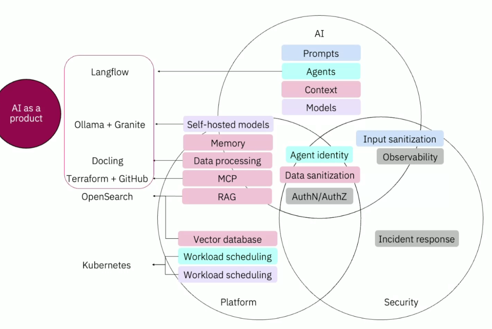
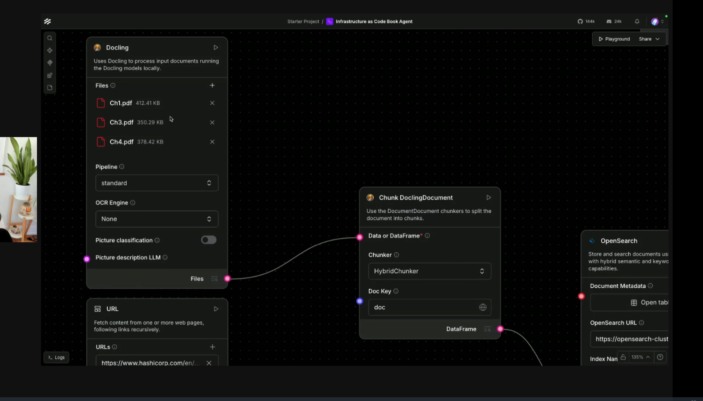
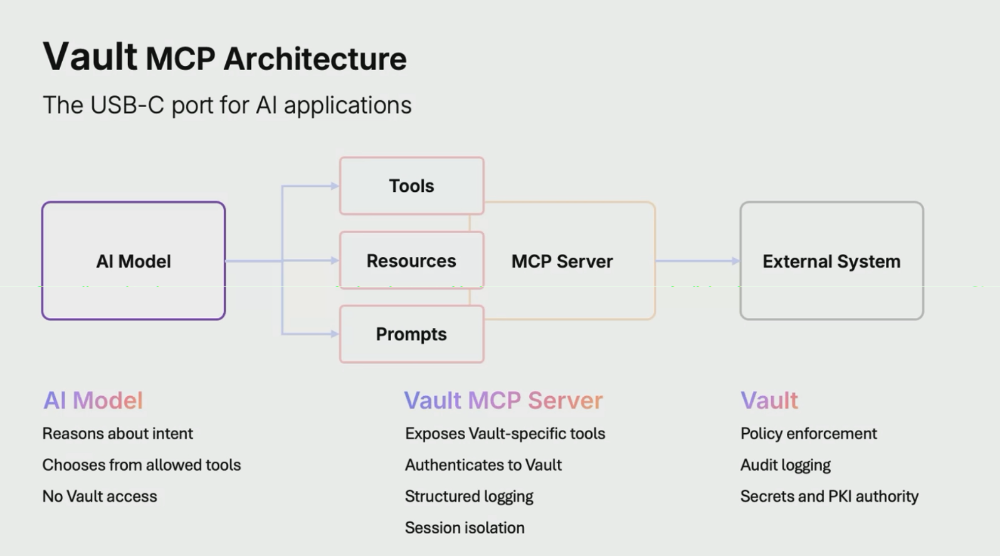
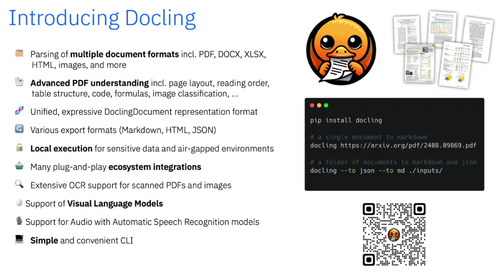

# AI - Automation

## Summary

* AI as platform "product"
* Identify your AI use Cases
* Scale AI via automation
* Automate with intervention

# From Secrets to Systems: Using the Vault MCP Server to Enable AI-Driven Platform Automation

- **Vault MCP:** https://developer.hashicorp.com/vault/docs/mcp-server/overview

https://www.langflow.org/

# Empowering Your AI Agents: Hands-On Exploration of Vector Search in Cassandra with watsonx.data

AI agents Demo 3 speakers

Gil Isaacs

Developer Relations, IBM

Aaron Ploetz

Developer Relations Engineer, IBM

Patrick McFadin

Principal Technical Strategist, IBM

## About the talk

AI agents are becoming ubiquitous, powering everything from personalized recommendations to intelligent automation. At the heart of every agent lies vectorized data, enabling semantic understanding and contextual responses. But how do you scale this capability for SaaS solutions serving millions of users? Join us for a hands-on workshop where we dive into the world of semantic search using wx.data Astra DB (built on Apache Cassandra®). Things you’ll learn/do: o Understand basics of AI embeddings and how semantic search differs from traditional keyword search. o Set up a vector search-enabled GenAI App with a database in Astra step-by-step. o Generate high-quality embeddings using NVIDIA NIMs. You will have a running semantic search demo and the know-how to continue building on it.

## Learn to Unlock Document Intelligence with Docling

Ming Zhao

Docling Developer Advocate, IBM

Abby Tse

Software Engineer, IBM

About the talk

Most organizational knowledge is still locked inside complex documents, making it difficult to extract and use the information effectively. Traditional tools often fail when working with real-world document formats, particularly PDFs. Tables lose their structure, figures get separated from captions, and multi-column layouts become unreadable text. These failures make it difficult to bring AI to document-heavy workflows. Docling is an open-source project that takes a different approach, using deep learning models **to parse documents the way humans read them**. It preserves hierarchy, extracts structured data through a consistent API, and supports 15+ file formats out of the box. In this session we'll explore how you can leverage Docling in your own AI workflows.

Code Assistants for DevOps

Alex Soto

Developer Advocate, IBM

About the talk

Software delivery used to be simpler. Releasing a COBOL application on a mainframe required deep expertise, but the technology stack was stable and well understood. Releasing today requires navigating a vast and complex ecosystem—Terraform, Ansible, Kubernetes, ArgoCD, CI/CD pipelines, cloud platforms, and more—significantly increasing cognitive load and friction between development and operations. This session explores how AI coding assistants can help teams adopt DevOps practices more effectively by reducing complexity and bridging knowledge gaps. We will show how AI assistants support writing and understanding infrastructure and platform code, accelerate onboarding, and improve collaboration between developers and operators.
